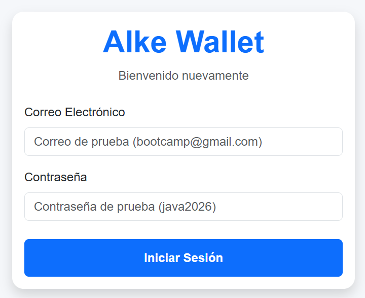
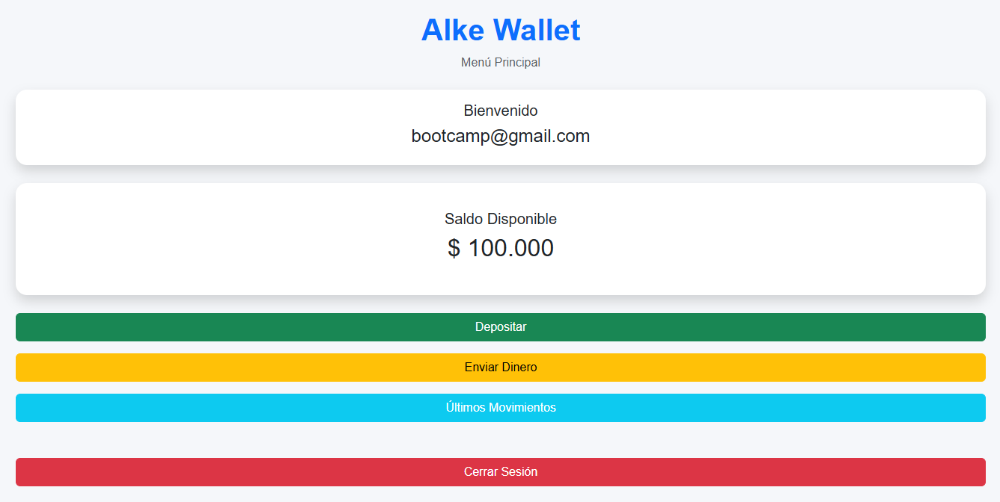
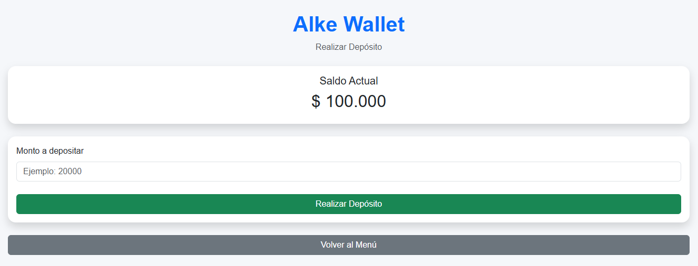
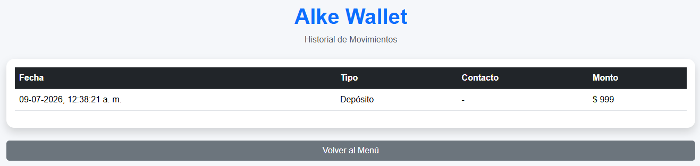

# 💳 Alke Wallet

Proyecto desarrollado como Evaluación Integradora del **Módulo 2** del Bootcamp **Full Stack Java Trainee**.

La aplicación simula una billetera digital (Wallet), permitiendo a un usuario iniciar sesión, visualizar su saldo, realizar depósitos, enviar dinero a contactos y consultar el historial de movimientos.

El proyecto fue desarrollado utilizando HTML, CSS, Bootstrap, JavaScript, JQuery, LocalStorage y Git, aplicando un flujo de trabajo basado en ramas (Git Flow) para el desarrollo de cada funcionalidad.


---
## 🎯 Objetivos del Proyecto

- Desarrollar una aplicación web utilizando HTML, CSS y Bootstrap.
- Implementar la lógica de negocio utilizando JavaScript y JQuery.
- Almacenar información del usuario mediante LocalStorage.
- Aplicar un flujo de trabajo con Git y GitHub utilizando ramas, commits y Pull Requests.
- Integrar los conocimientos adquiridos durante el Módulo 2 del Bootcamp Full Stack Java Trainee.


---
## 🛠 Tecnologías Utilizadas

- HTML5
- CSS3
- Bootstrap 5
- JavaScript (ES6)
- JQuery 3
- LocalStorage
- Git
- GitHub
- Visual Studio Code


---
## 🚀 Funcionalidades Implementadas

La aplicación **Alke Wallet** permite simular el funcionamiento básico de una billetera digital mediante las siguientes funcionalidades:


### 🔐 Inicio de Sesión

- Validación de correo y contraseña mediante credenciales de prueba.
- Almacenamiento del usuario autenticado utilizando LocalStorage.
- Redirección automática al menú principal.


### 🏠 Menú Principal

- Visualización del correo del usuario autenticado.
- Consulta del saldo disponible.
- Navegación hacia las distintas funcionalidades de la aplicación.
- Opción para cerrar sesión.


### 💰 Depósitos

- Registro de depósitos mediante un formulario.
- Validación del monto ingresado.
- Actualización automática del saldo.
- Registro del movimiento en el historial.


### 💸 Envío de Dinero

- Selección de un contacto.
- Validación del monto a transferir.
- Verificación de saldo disponible.
- Descuento automático del saldo.
- Registro del movimiento realizado.


### 📋 Historial de Movimientos

- Visualización de todos los depósitos y transferencias realizadas.
- Generación dinámica de la tabla utilizando JQuery.
- Persistencia de la información mediante LocalStorage.


---
## 📸 Capturas de Pantalla

A continuación se muestran las principales pantallas desarrolladas para la aplicación **Alke Wallet**.

<h3 align="center">🔐 Inicio de Sesión</h3>

<p align="center">

  
  
</p>

---

<p align="center">

### 🏠 Menú Principal



</p>

---

<p align="center">

### 💰 Depósitos



</p>

---

<p align="center">

### 📋 Historial de Movimientos



</p>


---
## 📁 Estructura del Proyecto

```text
m2s7_Alke_Wallet
│
├── css/
│   └── styles.css
│
├── img/
│   ├── login.png
│   ├── menu.png
│   ├── deposito.png
│   └── movimientos.png
│
├── js/
│   └── app.js
│
├── index.html
├── menu.html
├── deposit.html
├── sendmoney.html
├── transactions.html
│
├── README.md
└── .gitignore
```


### Organización del proyecto

- **css/**: Contiene la hoja de estilos principal de la aplicación.
- **js/**: Contiene toda la lógica desarrollada en JavaScript y JQuery.
- **index.html**: Pantalla de inicio de sesión.
- **menu.html**: Menú principal de la billetera.
- **deposit.html**: Permite realizar depósitos al saldo.
- **sendmoney.html**: Permite enviar dinero a un contacto.
- **transactions.html**: Muestra el historial de movimientos registrados.
- **img/**: Contiene las capturas de pantalla utilizadas en la documentación del proyecto.


---
## ▶️ Instalación y Ejecución

1. Clonar el repositorio:

```bash
git clone https://github.com/galagoszu/m2s7_Alke_Wallet.git
```


2. Abrir la carpeta del proyecto en Visual Studio Code.


3. Ejecutar la aplicación utilizando **Live Server** o abrir el archivo `index.html` desde el navegador.


4. Iniciar sesión utilizando las credenciales de prueba:

Correo:

```text
bootcamp@gmail.com
```

Contraseña:

```text
java2026
```


---
## 🌿 Flujo de Trabajo con Git y GitHub

Durante el desarrollo del proyecto se utilizó un flujo de trabajo basado en ramas (Git Flow simplificado), permitiendo desarrollar cada funcionalidad de manera independiente antes de integrarla a la rama principal.


### Ramas utilizadas

- `main`
- `feature/login`
- `feature/depositos`
- `feature/transacciones`
- `feature/historial-movimientos`


### Flujo de trabajo aplicado

Para cada funcionalidad se siguió el siguiente proceso:

1. Crear una nueva rama desde `main`.
2. Desarrollar la funcionalidad correspondiente.
3. Registrar los cambios mediante commits con mensajes descriptivos.
4. Subir la rama al repositorio remoto.
5. Crear un Pull Request en GitHub.
6. Revisar y fusionar la rama con `main`.
7. Actualizar la rama principal para continuar con el siguiente Sprint.


### Ejemplos de commits realizados

```text
chore: estructura inicial del proyecto

feat: implementar pantalla de login

feat: implementar funcionalidad de depósitos

feat: implementar envío de dinero

feat: implementar historial de movimientos

docs: finalizar documentación del proyecto
```


---
## 🎓 Aprendizajes Obtenidos

Durante el desarrollo de este proyecto fue posible integrar los conocimientos adquiridos a lo largo del Módulo 2 del Bootcamp Full Stack Java Trainee.

Entre los principales aprendizajes destacan:

- Creación de interfaces utilizando HTML5 y CSS3.
- Diseño responsivo mediante Bootstrap.
- Programación de la lógica de la aplicación con JavaScript.
- Manipulación del DOM utilizando JQuery.
- Persistencia de información mediante LocalStorage.
- Organización del código utilizando comentarios y buenas prácticas de desarrollo.
- Gestión del código fuente mediante Git y GitHub aplicando ramas, commits, Pull Requests y Merge.
- Desarrollo incremental de funcionalidades siguiendo un flujo de trabajo por Sprints.


---

## 👨‍💻 Autor

**Gabriel Lagos**

Proyecto desarrollado como parte del **Bootcamp Full Stack Java Trainee**, correspondiente a la **Evaluación Integradora del Módulo 2**.

Repositorio desarrollado con fines académicos, aplicando buenas prácticas de desarrollo web y control de versiones con Git y GitHub.

